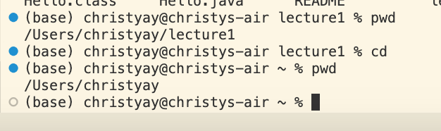
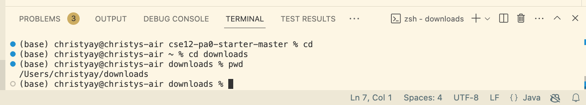
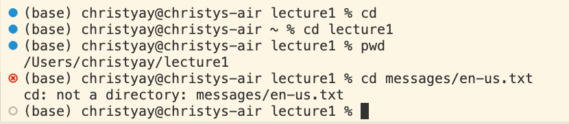
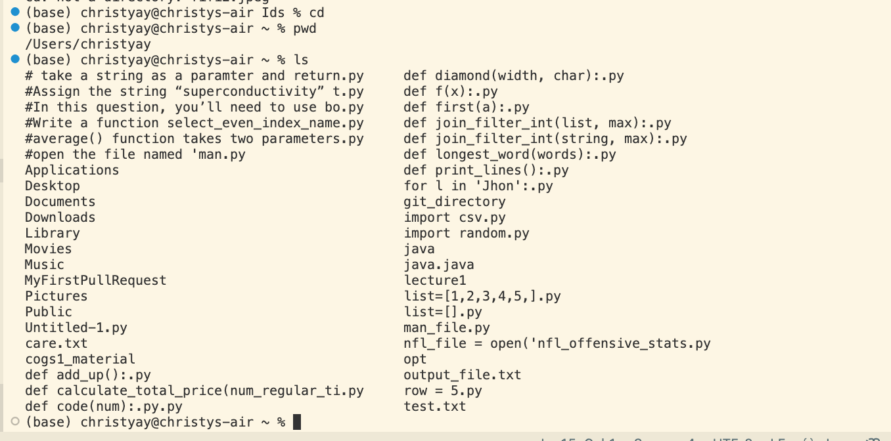
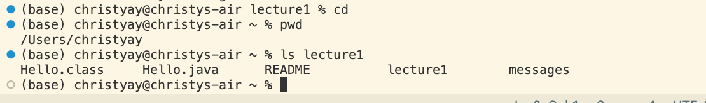
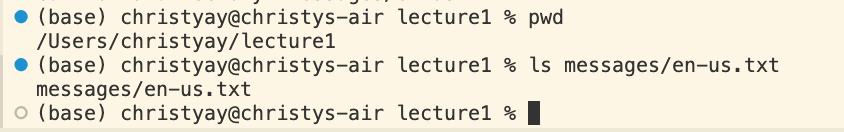
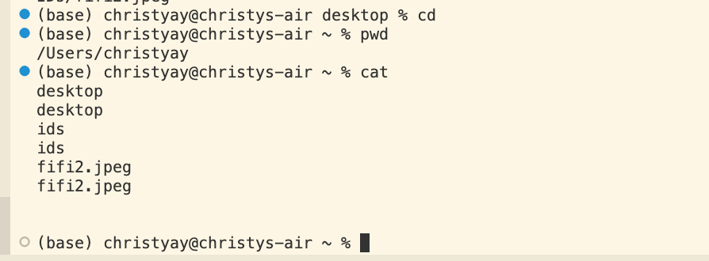
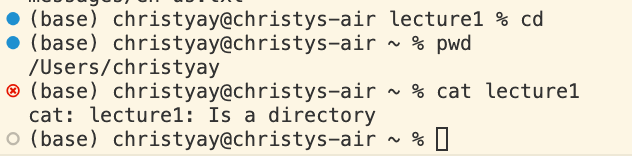
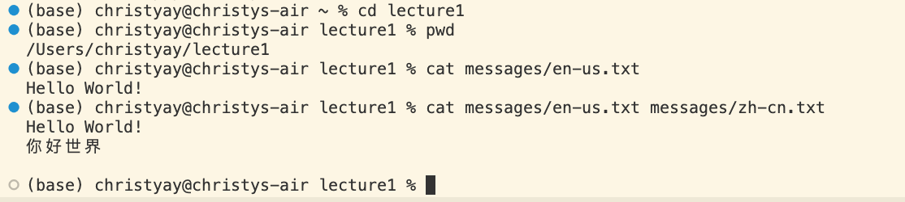

# Lab Report 1
## Command cd
### Command ran: `cd`

1. absolute path before command was ran: `/Users/christyay/lecture1`
2. There are no output that are produced Using `cd` and the output is not an error. using `cd` without any argument will set the working directory to home directory making the absolute path `/Users/christyay`which is the home directory.

  
### Command ran: `cd lecture1`

1. absolute path before command was ran:`/Users/christyay`
2. There are no output that are produced and the output is not an error.Using `cd` follow by a directory will set the working directory that directory. After running `cd` the working directory became `/Users/christyay/lecture1`
   
### Command ran: `cd messages/en-us.txt`

 

1. absolute path before command was ran: `/Users/christyay/lecture1`
2. We are trying to open the file name `en-us.txt` in folder `messages` and we can see that the output is an error (cd: not a directory: messages/en-us.txt), it produced an error because cd can't open an file and have to be follow by a diectory. 

## Command ls

### Command ran: `ls`

1. absolute path before command was ran:`/Users/christyay`
2. The output we get when using ls without any argument is a list of all folder and files in the current working directory. And output is not an error.

### Command ran: `ls lecture1`

1. absolute path before command was ran:`/Users/christyay`
2. The output we get when using ls follow by a path to a directory as an argument is a list of all folder and files in the given path. Output is not a error.

### Command ran: `ls messages/en-us.txt`

1. absolute path before command was ran: `/Users/christyay/lecture1`
2. We are trying to open the file name `en-us.txt` in folder `messages`, the output is not an error and it simply prints the path to the file which is `messages/en-us.txt`. 

## Command cat

### Command ran: `cat`

1. absolute path before command was ran:`/Users/christyay`
2. using cat command without any argument will result in a strange behavior where the terminal will simply wait for your input something then user can type in whatever you want, and when you press Enter, it will display what you typed back to you. This doesn not result in any error but it also serve no purpose as it just waits for an input and return the same output back to user.

### Command ran: `cat lecture1`

1. absolute path before command was ran:`/Users/christyay`
2. using cat command with a path to a directory as an argument will give you an error(cat: lecture1: Is a directory). we got an error because the argument follow by the cat command must be a file name or more than one file name but it cannot be a directory.

### Command ran: `cat messages/en-us.txt` and `cat messages/en-us.txt messages/zh-cn.txt`

1. absolute path before command was ran: `/Users/christyay/lecture1`
2. We are trying to open the file name `en-us.txt` as well as opening both `en-us.txt` and `zh-cn.txt` in folder `messages`. this did not produce an error and it printed the content inside the file we peovided. one argument prints the content in the single file, more than one argument will print content of each.

