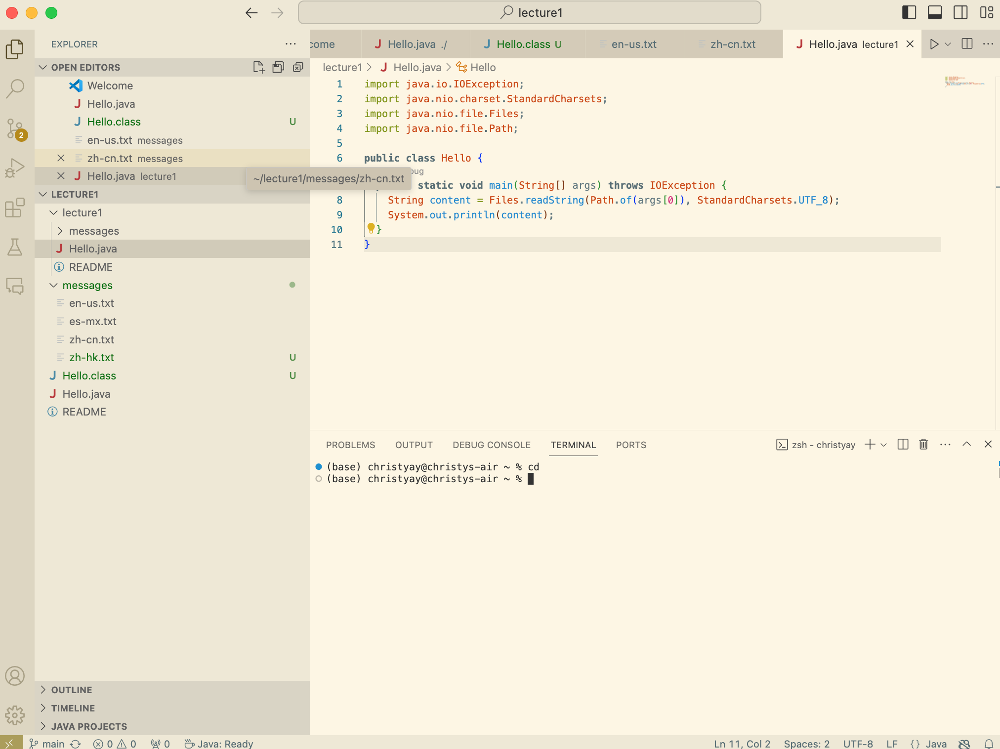

# Lab Report 1
## Command cd

`cd`
1. absolute path: `/Users/christyay`
2. There are no output that are produced.Using `cd` without any argument will set the working directory to home directory.
3. the output is not an error

`cd lecture1`
1. absolute path: `/Users/christyay/lecture1`
2. There are no output that are produced.Using `cd` follow by a directory will set the working directory that directory.
3. the output is not an error

 
`cd /Users/christyay/lecture1/Hello.java`
1. absolute path: `/Users/christyay`
2. The output is an error (cd: not a directory: /Users/christyay/lecture1/Hello.java), it produced an error because cd can't open an file and have to be follow by a diectory.
   

