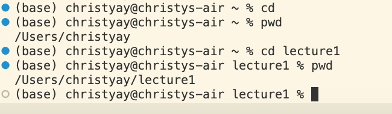

# Lab Report 1
## Command cd

`cd`
1. absolute path before command was ran: `/Users/christyay/Downloads/cse12-pa0-starter-master`
2. There are no output that are produced Using `cd` and the output is not an error. using `cd` without any argument will set the working directory to home directory making the absolute path `/Users/christyay`which is the home directory.
  

`cd downloads`
1. absolute path before command was ran:`/Users/christyay`
2. There are no output that are produced and the output is not an error.Using `cd` follow by a directory will set the working directory that directory. After running `cd` the working directory became `/Users/christyay/downloads`
   

 
`cd IDs/fifi2.jpeg`
1.absolute path before command was ran: `/Users/christyay/desktop`
2. We are trying to open the file name `fifi2.jpeg` in folder Ids and we can see that the output is an error (cd: not a directory: IDs/fifi2.jpeg), it produced an error because cd can't open an file and have to be follow by a diectory. 

   

