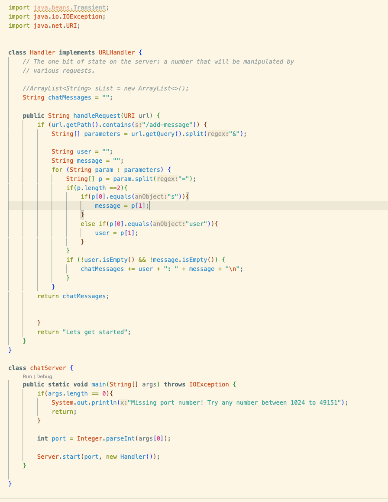
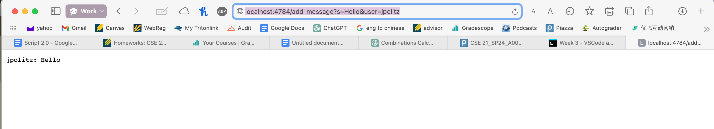
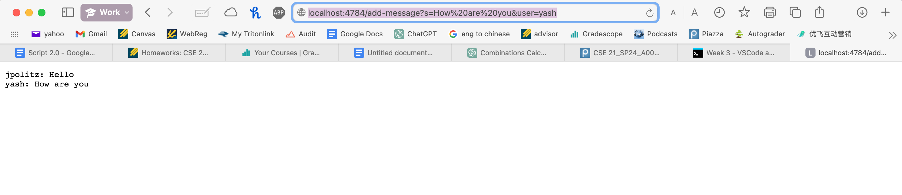
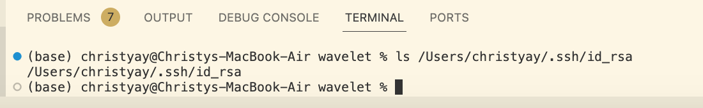
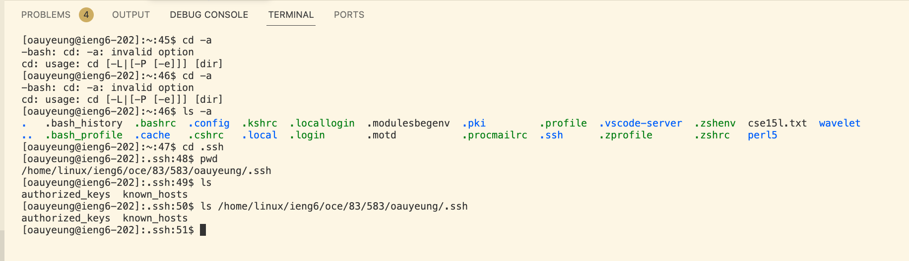
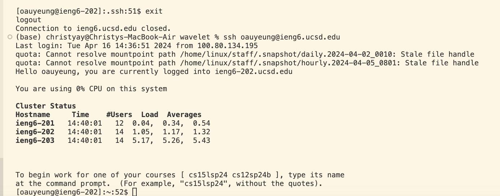

# Lab report 2
## Part 1
### code for `ChatServer`

### screenshot of command `/add-message?s=Hello&user=jpolitz`

1. The method that are called is the `handleRequest(URI url)`method
2. the relevant arguments to this methods is url of type URI which have the value`new URL(http://localhost:4784/add-message?s=Hello&user=jpolitz)` And we also have a class field `String chatMessages` which is initiaed to an empty string and gets updated everytime an command is called,
3. The value of the String after the method is call becomes "jpolitz: Hello".

### screenshot of command `/add-message?s=How are you&user=yash`

1. The method that are called is the `handleRequest(URI url)`method
2. the relevant arguments to this methods is url which have the value of `new URL(http://localhost:4784/add-message?s=How%20are%20you&user=yash))`
And we also have a class field `String chatMessages` which has the value "jpolitz: Hello" stored 
3. The value of the String after the method is call becomes "jpolitz: Hello\nyash: How are you"

## Part 2
1. 
2.  
3.   

## Part 3
Something I learned from week2 and week 3 that I didn't know before include how to open a new local host and writing and reading code that perform different operations. I also learned how to use curl to access the local host through the terminal.
