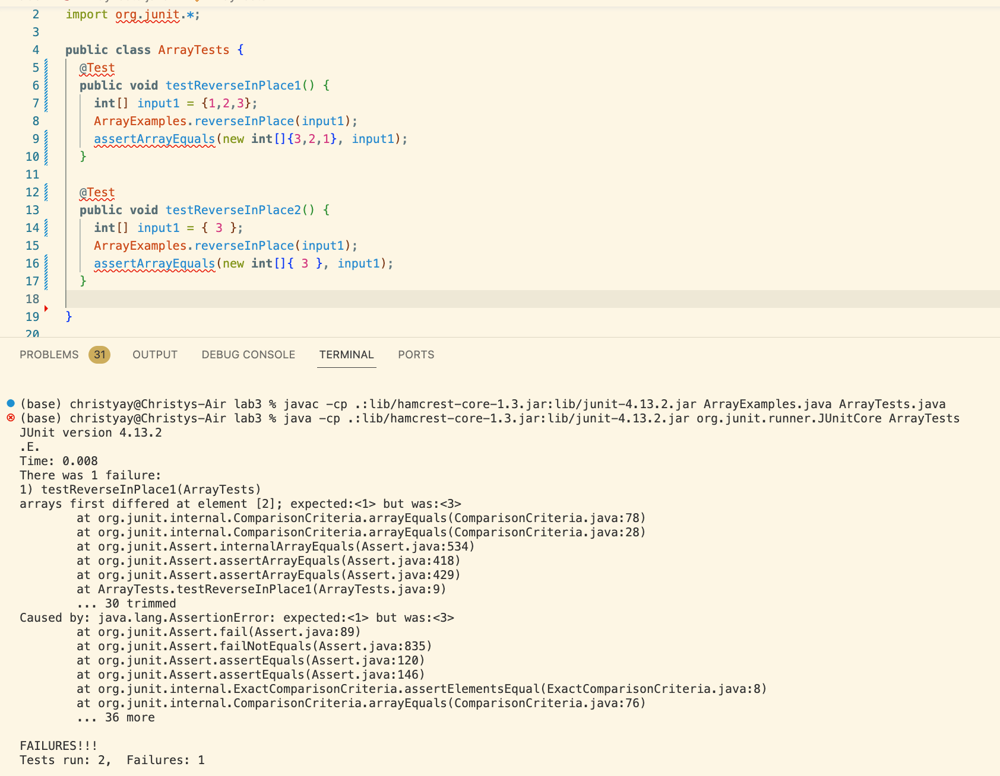

# Lab Report 3
## Part1- Bug
The code I picked is `reverseInPlace(int[] arr)` method in the file`ArrayTest.java`
1. failure-inducing input
```
@Test 
	public void testReverseInPlace1() {
    int[] input1 = {1,2,3};
    ArrayExamples.reverseInPlace(input1);
    assertArrayEquals(new int[]{3,2,1}, input1);
}

2.An input that doesn't induce a failure
```
```
@Test 
	public void testReverseInPlace2() {
    int[] input1 = { 3 };
    ArrayExamples.reverseInPlace(input1);
    assertArrayEquals(new int[]{ 3 }, input1);
	}
```

3.  the output of running the two tests above


We can see that the `testReverseInPlace1()`failed and the `testReverseInPlace2()`passed

4.the before-and-after code change required to fix it 
Before:
```
static void reverseInPlace(int[] arr) {
     for(int i = 0; i < arr.length; i += 1) {
          arr[i] = arr[arr.length - i - 1];
     }
}
```
After:
```
static void reverseInPlace(int[] arr) {
    for(int i = 0; i < arr.length/2 ; i += 1) {
      int placeHolder = arr[i];
      arr[i] = arr[arr.length - i - 1];
      arr[arr.length - i - 1] = placeHolder;
    }
}
```


  
  
