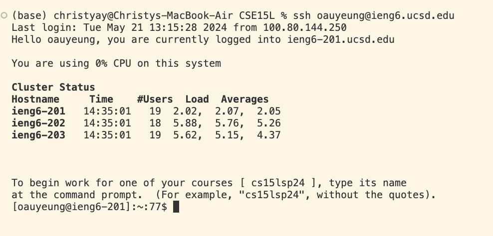
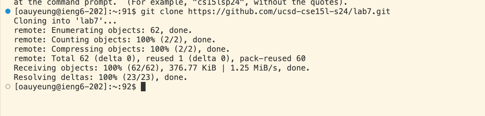
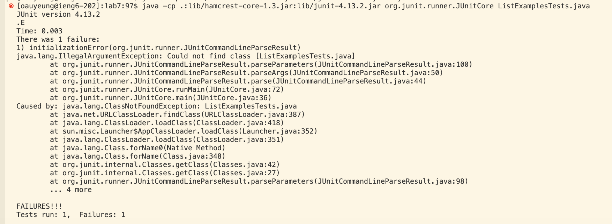
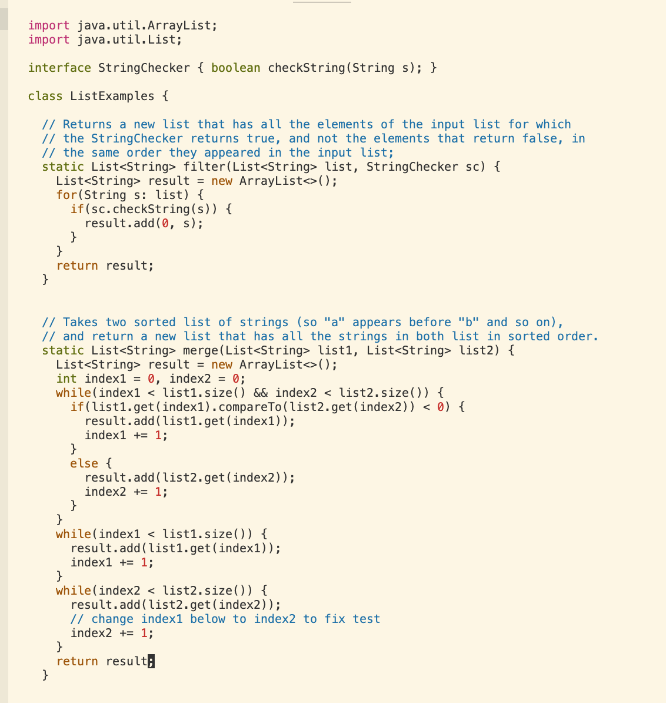
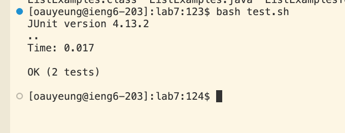
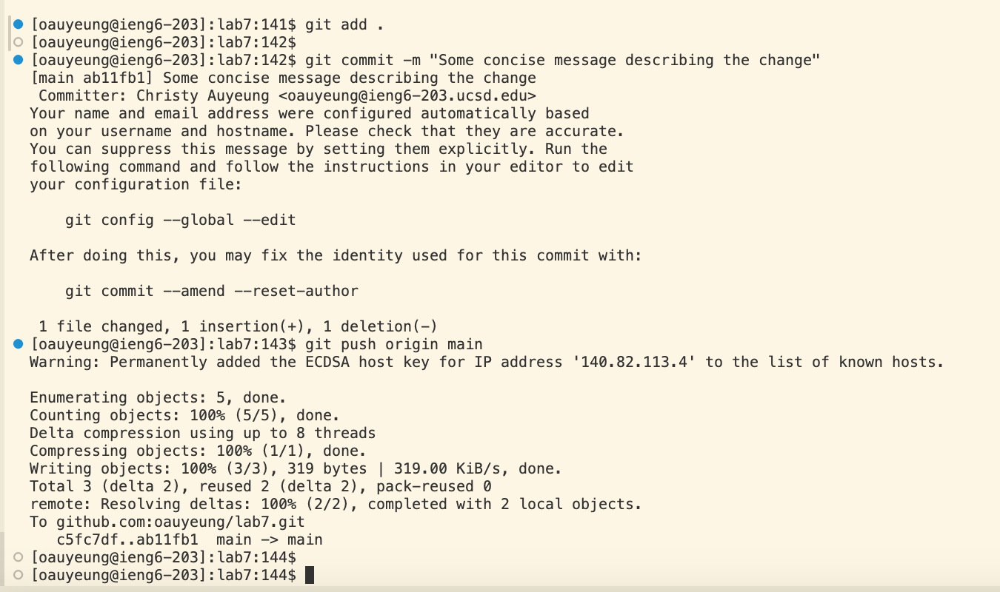

# Lab Report 4

Keys pressed: `<Ctrl-R><space>ssh <up><enter>`
Summary: I used the <Ctrl-R> command then typed in part of a command "ssh" the <Ctrl-R> command allow me to look at the command history that associate with the key word I entered then I clicked the up key to select the command and enter to run. This way I can quickly find the command history of ssh.

Keys pressed: `git<space>clone<space><Comm-V>`

Summary: I first copied the link from Github then paste the link into the terminal

Keys pressed: `<up><up><up><up><up><enter>`
Summary: The javac -cp .:lib/hamcrest-core-1.3.jar:lib/junit-4.13.2.jar *.java command was 5 up in the search history, so I used up arrow to access it and enter to run it after accessing it. 

Keys pressed: `<up><up><up><up><enter>`
The java -cp .:lib/hamcrest-core-1.3.jar:lib/junit-4.13.2.jar org.junit.runner.JUnitCore  ListExamplesTests.java command was 4 up in the history(one below javac), so I accessed and ran it in the same way as javac.

key pressed `vim ListExamples.java<Enter>

:44 (to move down for 44 times) 

5l (to move right for 5 times) 

x (to delete 1) 

i (change to insertion mode

2 (add 2

`<esc>` (to escape from insertion mode) 

:wq `<enter>` (to save and exit)

key pressed: `bash<space>test.sh<enter>`
I used bash test.sh this time to run the test as there is already test cases in test.sh so this makes testing quicker.

`git<space>add<space>`.
`git<space>commit<space>-m<space>"Some concise message describing the change"`
`git<space>push<space>origin<space>main`

