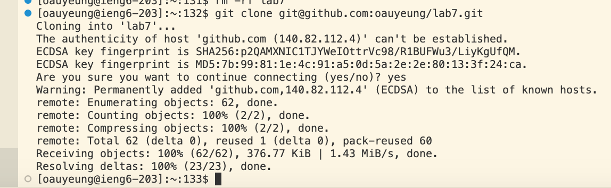

# Lab Report 4

1. Step 4

Keys pressed: `<Ctrl-R><space>ssh <up><enter>`
 

Summary: I used the <Ctrl-R> command then typed in part of a command "ssh" the <Ctrl-R> command allow me to look at the command history that associate with the key word I entered then I clicked the up key to select the command and enter to run. This way I can quickly find the command history of ssh.

2. Step 5

Keys pressed: `git<space>clone<space><Comm-V>`
\\
Summary: I first copied the link from Github then paste the link into the terminal

3. Step 6

Keys pressed: `<up><up><up><up><up><enter>`
Summary: The javac -cp .:lib/hamcrest-core-1.3.jar:lib/junit-4.13.2.jar *.java command was 5 up in the search history, so I used up arrow to access it and enter to run it after accessing it. 

Keys pressed: `<up><up><up><up><enter>`
The java -cp .:lib/hamcrest-core-1.3.jar:lib/junit-4.13.2.jar org.junit.runner.JUnitCore  ListExamplesTests.java command was 4 up in the history(one below javac), so I accessed and ran it in the same way as javac.

4. Step 7

key pressed `vim<space>ListExamples.java<Enter>
:44<enter>
5l
x
i
2
<esc>
:wq<enter>`
Summary: I first enter vim into the ListExamples.java file to edit the file. Then I used the command :44 to get to the 44th line, then using 5l to more right 5 time and got to the letter 1 which is the letter we want to make changes on. then I pressed x to delet the letter one and use i the enter insertion mode. then I pressed 2 to insert that letter in the file and esc to escape from insert mode since I am done editing. then I used :wq to save and exit.
5. Step 8

key pressed: `bash<space>test.sh<enter>`
I used bash test.sh this time to run the test as there is already test cases in test.sh so this makes testing quicker.

6. Step 9

`git<space>add<space>.`
`git<space>commit<space>-m<space>"Some concise message describing the change"`
`git<space>push<space>origin<space>main`

