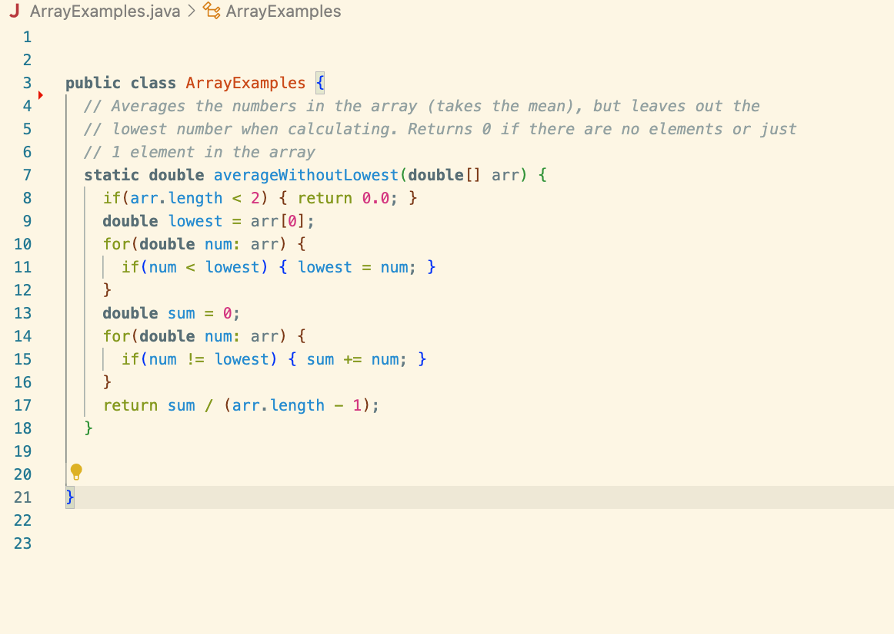
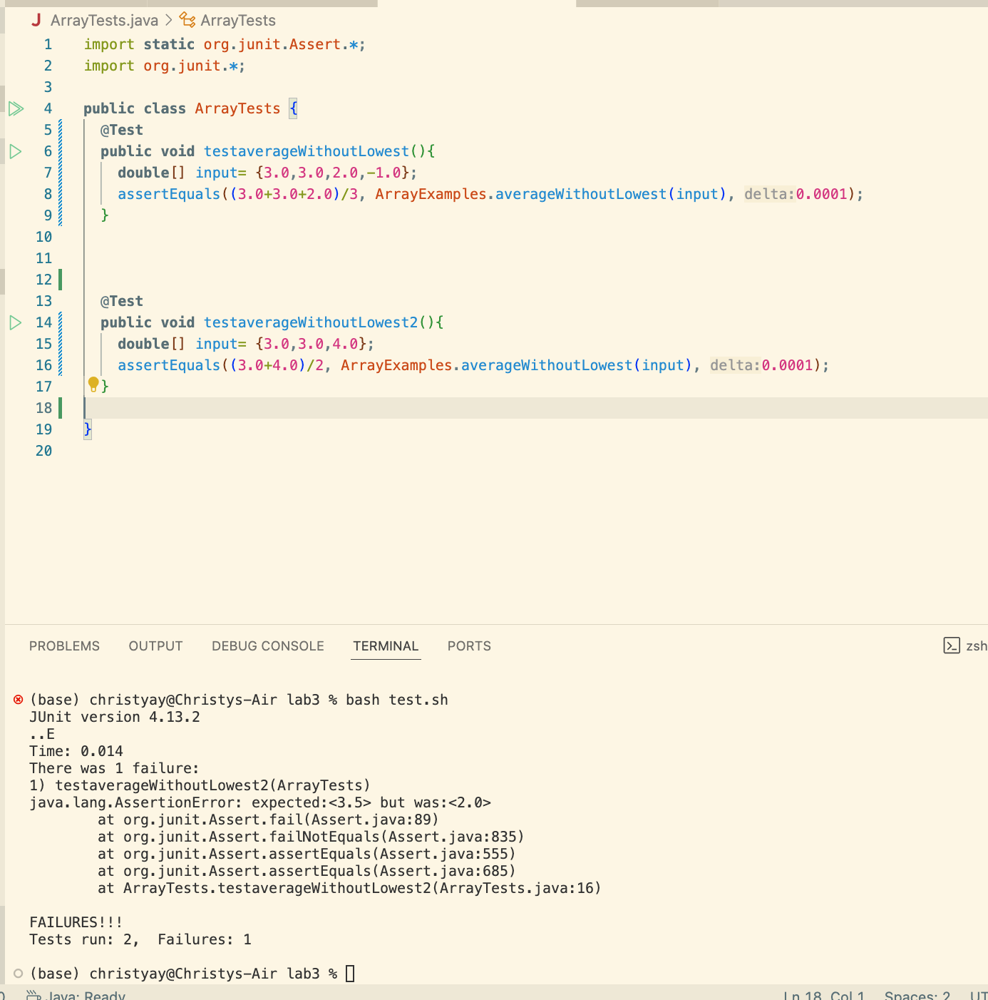
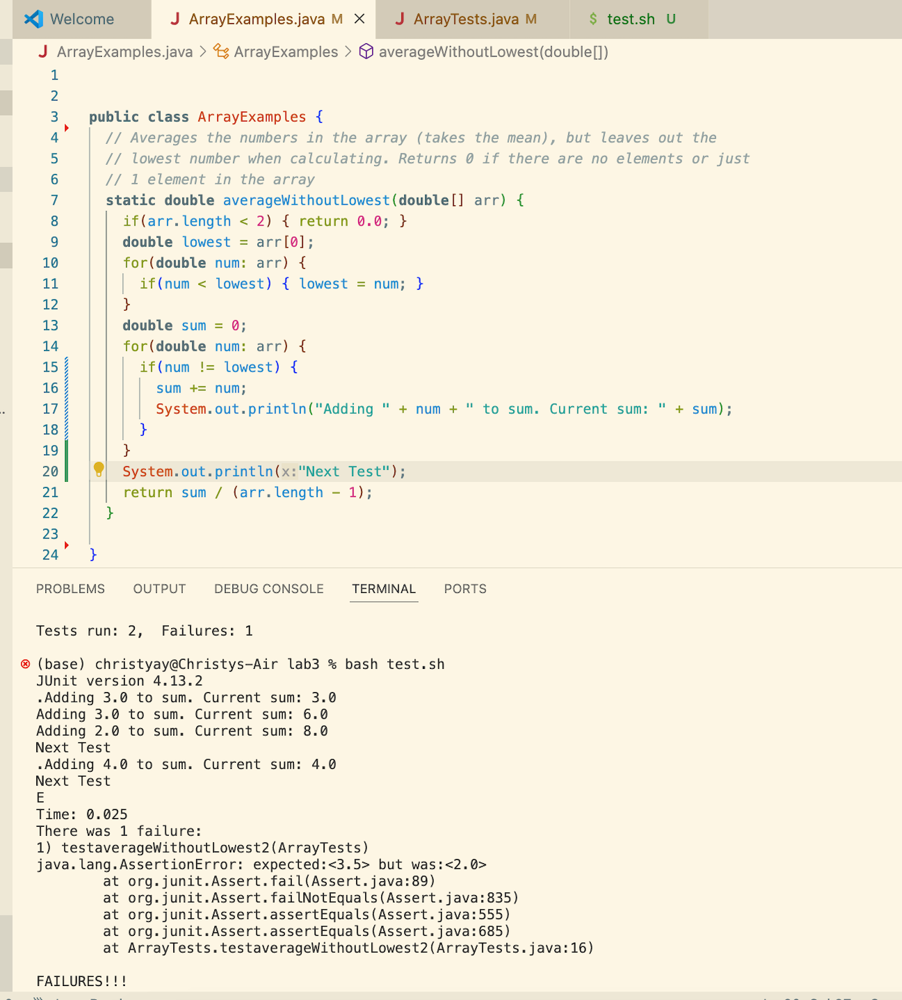
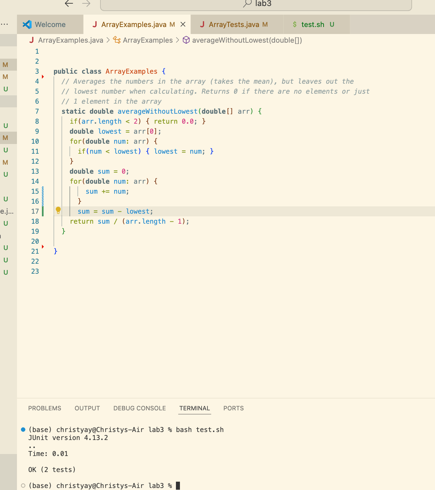
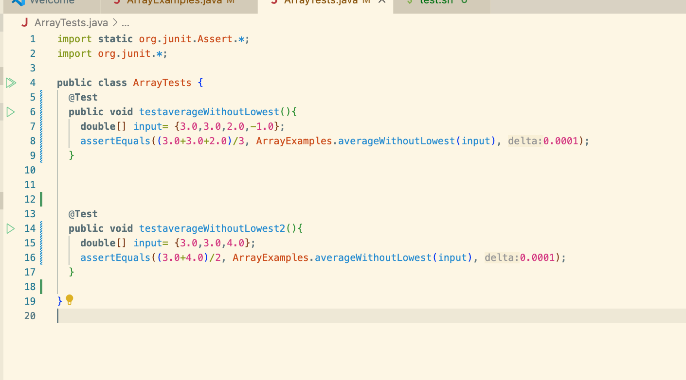
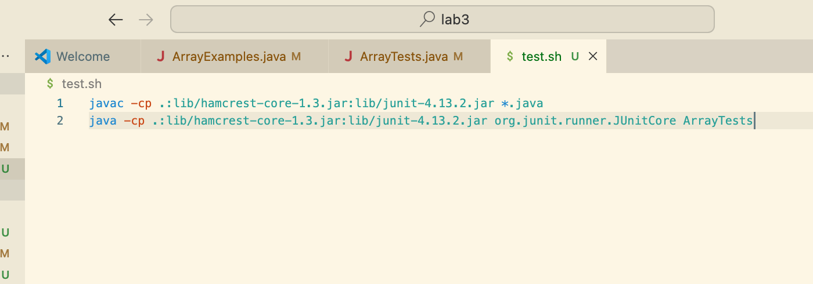

### Part1
#### Original Post from a Student on Piazza

Student Post:

Subject: Bug in averageWithoutLowest Method

Hi,

I'm having trouble with the `averageWithoutLowest` method in my `ArrayExamples` class. It doesn't seem to be calculating the average correctly when there are multiple instances of the lowest value. For example, with the input {3.0, 3.0, 4.0}, I expect the result to be (3.0 + 4.0) / 2 =3.5, but I'm not getting that and got 2.0 instead. I am guessing that the bug have something to do with not correctly adding up the items in the array. Any ideas on what might be wrong? I attached picture of my code and the test case I used to run my code.

Screenshot:

Thanks!

#### Response from a TA

**TA Response:**
Hi ,

You are right, It looks like the issue might be with how you're summing up the values. Specifically, you're excluding all of the instance of the lowest value, which might not be sufficient if the lowest value occurs multiple times because what we want to do here is to only exclude the lowest value once, you can see that when you only have one instances of the lowest value your test pass(testaverageWithoutLowest()), however when you have more than 1 instances of the lowest value you code fail.

To better understand the behavior, can you add a print statement inside the second loop to print out each value being added to the sum to see the behavior of values that are being added.

Run your test again and share the output with us.

#### Follow-up Post from the Student

**Student Post:**
Subject: Re: Bug in averageWithoutLowest Method

Hi ,

I added the print statement as you suggested. Here's the output when I run my test:

It looks like when there is more than one instances of the lowest value, the value is not added to the sum at all, I realized the problem is actually in how I'm handling the lowest value. The intended behavior is to exclude only one instance of the lowest number, but the bug is that it is excluding all instances of the lowest number. I notice my code had a if statement that only adds the value in the array if the value is not the lowest which is what casuing the bug, I got rid of that line and added another line to subtract the lowest value once from the sum and the code work as intended. 

Thanks,
[Student's Name]

mathematica
Copy code

#### Information Needed About the Setup

**File & Directory Structure:**
/Users/christyay/lab3/ArrayExamples.java
/Users/christyay/lab3/ArrayTests.java
/Users/christyay/lab3/test.sh

**Contents of Each File Before Fixing the Bug:**
1. ArrayExamples.java

3. ArrayTests.java

5. test.sh

The full command line (or lines) you ran to trigger the bug:
`bash test.sh` 
this command triggered the javac and java written in test.sh which compiled and run the test cases in ArrayTests.java.

A description of what to edit to fix the bug:
The bad code had a if statement that only adds the value in the array if the value is not the lowest which is what casuing the bug, I got rid of that line and added another line to subtract the lowest value once from the sum and the code work as intended. 

### Part 2
Something I learned from the second half of the quarter that stood out to me the most is using Vim to edit files in the terminal. Vim is a highly efficient and convience text editor that, once mastered, it significantly enhances productivity when working with code and text files directly from the terminal. Initially, the numerous commands and shortcuts in Vim seemed overwhelming, but with practice, they became easy to use and very convuence. I think that Vim allows for fast navigation and editing of text without the need to switch between different applications, making it an powerful tool for developers. Before taking this class, I was unaware of Vim's existence, Learning to use Vim has equipped me with a valuable skill that increases my efficiency in coding and editing tasks. It's a useful trick to have in my toolkit.
